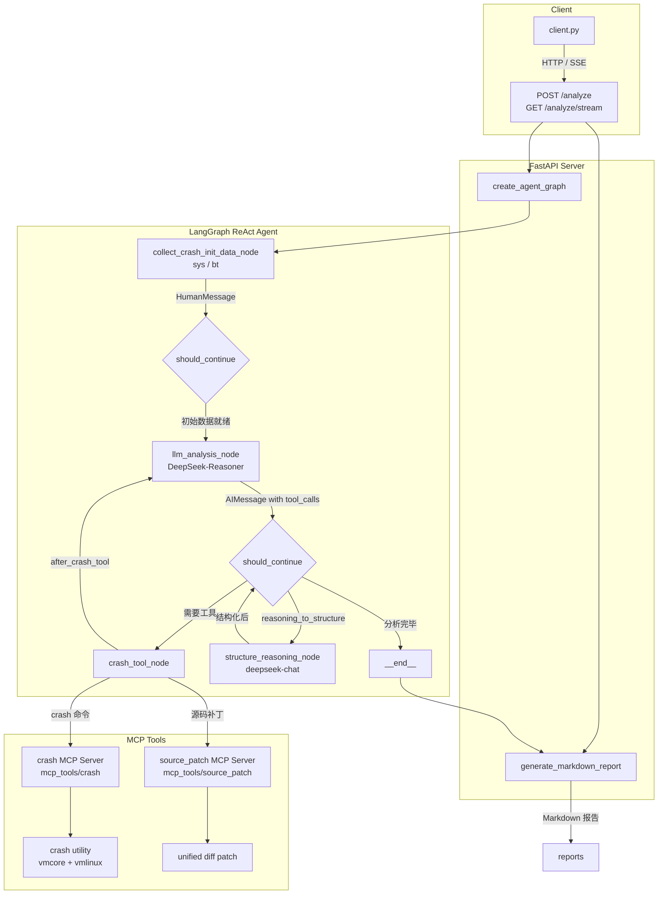
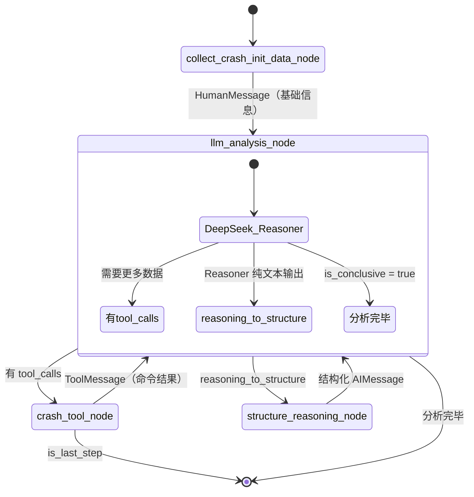

# VMCore Analysis Agent

一个基于 LangGraph ReAct 模式与 MCP 工具的智能 Linux 内核崩溃（vmcore）分析代理。

## 项目介绍

### Linux Kernel Crash 定位分析

Linux 内核崩溃分析是系统工程领域皇冠上的明珠，也是最具挑战性的技术难题之一。

**挑战与难点**：
- **知识体系庞杂**：要求精通 C 语言、操作系统原理、常用数据结构与算法、内核子系统架构（内存管理、调度、文件系统等）。
- **技能要求极高**：需掌握各类硬件工作原理及内核基础架构实现，熟练运用 crash、gdb 等复杂的调试工具。
- **推理能力门槛**：在海量堆栈和内存数据中抽丝剥茧，需要极其强大的逻辑推理和归纳分析能力。

**项目核心优势**：
本项目创新性地引入了 **ReAct (Reasoning + Acting)** 模式的 AI Agent 架构，结合 **MCP (Model Context Protocol)** 工具体系，实现了自动化的 vmcore 深度分析：
- **专家经验数字化**：复刻 RHEL 资深工程师的分析思维，通过精心设计的专业 Prompts，让 LLM 习得顶级专家的推理路径。
- **工具使用智能化**：AI 能够自主规划和执行 crash 调试命令，像人类专家一样动态探索内存现场，而非简单的静态匹配。
- **分析过程透明化**：提供完整的思考链（Chain of Thought）和操作记录，不仅给出结论，更展示完整的分析逻辑。

## 架构设计

### 整体架构图



## Vmcore Analysis React Agent

### 代理架构

基于 LangGraph 的 ReAct（推理 - 行动）代理，包含四个核心节点：

| 节点 | 说明 |
|------|------|
| `collect_crash_init_data_node` | 初始节点，并发执行 `sys`、`bt` 等命令收集 vmcore 基础信息 |
| `llm_analysis_node` | 调用 DeepSeek-Reasoner，输出结构化 `VMCoreAnalysisStep`，决定下一步行动 |
| `crash_tool_node` | 解析 LLM 工具调用请求，通过 MCP 并发执行 crash 命令 |
| `structure_reasoning_node` | 当 Reasoner 返回纯文本 `reasoning_content` 时，用 deepseek-chat 将其结构化（可选） |

### 节点流转图



### 详细节点说明

#### 节点 1：collect_crash_init_data_node

**功能**：执行默认的 crash 命令集合，收集 vmcore 基础信息

**默认命令**：
```python
DEFAULT_CRASH_COMMANDS = [
    "sys",  # 系统信息（内核版本、崩溃时间等）
    "bt",   # 崩溃现场的堆栈回溯
]
```

执行结果以 `HumanMessage` 形式写入消息队列，作为 LLM 分析的初始上下文。

#### 节点 2：llm_analysis_node

**功能**：调用 DeepSeek-Reasoner，按 ReAct 模式输出结构化分析步骤

**核心 Prompt 设计**：
- 角色定义为资深 Linux Kernel Crash Dump 分析专家
- 严格遵循 `VMCoreAnalysisStep` JSON Schema 输出
- 内置防止重复执行同一命令的规则（Anti-Repetition Policy）
- 禁止触发 token 溢出的高危命令（`sym -l`、`bt -a`、`ps -m` 等）
- 支持 `run_script` 批量执行，确保模块符号在同一 crash session 内加载

**输出 Schema**：
```json
{
  "step_id": 1,
  "reasoning": "分析当前状态，决定下一步",
  "action": { "command_name": "bt", "arguments": ["-c", "3"] },
  "is_conclusive": false,
  "final_diagnosis": null,
  "fix_suggestion": null,
  "confidence": null,
  "additional_notes": null
}
```

#### 节点 3：crash_tool_node

**功能**：接收 LLM 的工具调用请求，通过 MCP 并发执行 crash 命令

**技术实现**：
- 使用 `langchain-mcp-adapters` 加载 MCP 工具
- 通过 `asyncio.gather` 并发执行多条命令，提升效率
- 每次调用独立管理 MCP 会话生命周期
- 安全封装工具调用，捕获异常并以错误字符串返回，不中断流程

**支持的 MCP 工具服务**：
- **crash MCP Server**：提供 `run_script` 及各 crash 子命令（`bt`、`dis`、`struct`、`kmem`、`sym` 等）
- **source_patch MCP Server**：根据 LLM 的源码分析结论生成 unified diff patch 文件

#### 节点 4：structure_reasoning_node（可选）

**功能**：DeepSeek-Reasoner 有时仅返回 `reasoning_content` 纯文本而 `content` 为空，此节点使用 deepseek-chat 将其转化为合法的 `VMCoreAnalysisStep` JSON，保证图的正常流转。

### 路由逻辑（should_continue / after_crash_tool）

```python
def should_continue(state: AgentState) -> str:
    # 1. 发生错误 → 结束
    if error_state and error_state.get("is_error"):
        return "__end__"

    # 2. 需要结构化 reasoning_content → structure_reasoning_node
    if state.get("reasoning_to_structure"):
        return structure_reasoning_node

    # 3. AIMessage 带 tool_calls → crash_tool_node（除非是最后一步）
    if isinstance(last_message, AIMessage) and tool_calls:
        return crash_tool_node if not is_last_step else "__end__"

    # 4. AIMessage 无 tool_calls（is_conclusive=true）→ 结束
    if isinstance(last_message, AIMessage):
        return "__end__"

    # 5. HumanMessage（初始数据收集完毕）→ llm_analysis_node
    if isinstance(last_message, HumanMessage):
        return llm_analysis_node
```

### MCP Crash 工具调用示例

```python
# 并发执行多条 crash 命令
async def dispatch_crash_commands(commands, state):
    async with crash_client(state) as tools:
        tasks = [_invoke_tool(tool, cmd, state) for cmd in commands]
        results = await asyncio.gather(*tasks, return_exceptions=True)
    return list(zip(commands, results))

# 单条工具调用
result = await tool.ainvoke({
    "command": "bt -c 3",
    "vmcore_path": state["vmcore_path"],
    "vmlinux_path": state["vmlinux_path"],
})
```

## 项目结构

```
vmcore-analysis-agent/
├── README.md                          # 项目说明文档
├── main.py                            # FastAPI 服务入口
├── pyproject.toml                     # Python 项目配置
├── config/
│   └── config.yml                     # LLM / MCP 配置文件
├── client/
│   └── client.py                      # 命令行客户端
├── src/
│   ├── llm/
│   │   └── model.py                   # DeepSeek LLM 初始化
│   ├── react/
│   │   ├── graph.py                   # LangGraph 图构建
│   │   ├── nodes.py                   # 节点实现
│   │   ├── edges.py                   # 路由逻辑
│   │   ├── graph_state.py             # AgentState 定义
│   │   ├── prompts.py                 # 专业分析 Prompt
│   │   ├── llm_node.py                # LLM 调用与结构化
│   │   ├── report_generator.py        # Markdown 报告生成
│   │   └── logging_callback.py        # 图执行日志回调
│   ├── mcp_tools/
│   │   ├── crash/                     # crash MCP Server
│   │   │   ├── server.py              # FastMCP 工具注册
│   │   │   ├── executor.py            # crash 命令执行器
│   │   │   └── client.py              # MCP 客户端封装
│   │   └── source_patch/              # source_patch MCP Server
│   │       ├── server.py              # patch 生成工具
│   │       └── client.py              # MCP 客户端封装
│   └── utils/                         # 日志、配置等工具函数
├── simulate-crash/                    # 内核崩溃模拟模块
│   ├── rcu_stall/                     # RCU stall 复现
│   └── soft_lockup/                   # Soft lockup 复现
├── reports/                           # 分析报告输出目录
├── logs/                              # 运行日志目录
└── tools/
    └── show_first_global_func.sh      # 调试符号验证脚本
```

## 快速开始

### 1. 安装依赖

```bash
cd vmcore-analysis-agent
uv sync
```

### 2. 配置

编辑 `config/config.yml`，配置 LLM API Key 和 MCP 服务路径：

```yaml
llm:
  api_key: "your-deepseek-api-key"
  model: "deepseek-reasoner"
  base_url: "https://api.deepseek.com"
```

### 3. 启动 FastAPI 服务

```bash
# 方式1：直接运行
python main.py

# 方式2：使用 uvicorn（推荐，支持热加载）
uvicorn main:app --host 0.0.0.0 --port 8000 --reload
```

服务启动后：
- API 文档：http://localhost:8000/docs
- 健康检查：http://localhost:8000/health

### 4. 使用客户端调用分析接口

#### 4.1 检查服务健康状态

```bash
uv run client/main.py --health
```

#### 4.2 标准流式分析（推荐）

```bash
uv run client/main.py --url http://192.168.14.132:8000 --stream \
                       --vmcore-path "/crash_case/Case_04387188/vmcore" \
                       --vmlinux-path "/usr/lib/debug/lib/modules/4.18.0-305.40.2.el8_4.x86_64/vmlinux" \
                       --vmcore-dmesg-path "/crash_case/Case_04387188/vmcore-dmesg.txt"
```

#### 4.3 同步模式分析（可选）

```bash
uv run client/main.py
```

#### 4.4 自定义参数分析

```bash
uv run client/main.py --vmcore-path "/path/to/vmcore" \
                      --vmlinux-path "/path/to/vmlinux" \
                      --vmcore-dmesg-path "/path/to/vmcore-dmesg.txt" \
                      --debug-symbols "/path/to/module1.ko" "/path/to/module2.ko"
```

#### 4.5 指定服务地址

```bash
uv run client/main.py --url http://192.168.1.100:8000 --stream
```

#### 4.6 报告保存选项

```bash
# 流式模式分析并保存报告到当前目录（默认行为）
uv run client/main.py --stream

# 指定报告输出目录
uv run client/main.py --stream --output-dir ./reports

# 不保存文件，仅显示
uv run client/main.py --stream --no-save
```

#### 4.7 客户端完整参数说明

```
参数说明：
  --url URL                   API 服务地址 (默认: http://localhost:8000)
  --stream                    使用流式模式
  --health                    仅检查服务健康状态
  --vmcore-path PATH          vmcore 文件路径
  --vmlinux-path PATH         vmlinux 调试符号路径
  --vmcore-dmesg-path PATH    vmcore-dmesg.txt 文件路径
  --debug-symbols [PATH ...]  额外的调试符号路径列表
  --timeout SECONDS           请求超时时间（秒）(默认: 600)
  --output-dir DIR            报告输出目录 (默认: 当前目录)
  --no-save                   不保存 markdown 报告文件
```

**说明**：
- 分析完成后，默认会自动保存 markdown 报告到指定目录
- 报告文件名格式：`127.0.0.1-2026-01-30-22-51-43.md`（从服务器 IP 和时间戳生成）
- 报告包含完整的分析过程、推理步骤和最终诊断结论

## 应用场景

1. **自动化故障诊断**：自动分析 vmcore 文件，减少人工干预
2. **知识库构建**：从历史案例中提取可复用的诊断逻辑
3. **新手培训**：作为学习内核调试的教学工具
4. **生产环境监控**：集成到运维平台，实现自动告警分析

## 未来扩展

1. **更多诊断场景**：支持除 lockup 外的其他内核问题
2. **多模态分析**：结合日志、指标等多维度数据
3. **实时分析**：支持在线系统的实时诊断
4. **分布式部署**：支持大规模并发分析

## 附录：第三方驱动调试符号编译指南 (以 mlx5_core 为例)

在分析涉及第三方驱动（如 Mellanox 网卡驱动）的 vmcore 时，如果默认驱动缺少调试符号，需要手动安装源码并重新编译。以下是标准操作流程：

### 1. 环境准备

安装驱动源码包和对应的内核开发包：

```bash
# 安装 Mellanox 驱动源码
rpm -ivh mlnx-ofa_kernel-source-5.8-OFED.5.8.3.0.7.1.rhel8u4.x86_64.rpm

# 安装对应版本的内核开发包（需与 vmcore 的内核版本一致）
rpm -ivh --oldpackage kernel-devel-4.18.0-305.130.1.el8.x86_64.rpm
```

### 2. 编译带调试信息的模块

进入源码目录并配置编译选项：

```bash
cd /usr/src/ofa_kernel-5.8/source

# 配置编译选项：开启 debug info，指定内核源码路径
./configure --with-debug-info --with-mlx5-mod \
                 --kernel-sources /usr/src/kernels/4.18.0-305.130.1.el8_4.x86_64 \
                 --cache-file=my_config.cache

# 执行编译
make -j$(nproc)
```

### 3. 验证调试符号

编译完成后，通过以下方式验证模块是否包含调试信息：

```bash
# 1. 检查 debug section 是否存在
readelf -S drivers/net/ethernet/mellanox/mlx5/core/mlx5_core.ko | grep debug

# 2. 尝试反汇编导出源码（验证源码关联）
objdump -S -d drivers/net/ethernet/mellanox/mlx5/core/mlx5_core.ko > mlx5_debug.asm

# 3. 使用工具脚本验证符号解析
./tools/show_first_global_func.sh /usr/src/ofa_kernel-5.8/source/drivers/net/ethernet/mellanox/mlx5/core/mlx5_core.ko
```

## 贡献指南

欢迎提交 Issue 和 Pull Request 来改进项目。

## 许可证

MIT License
