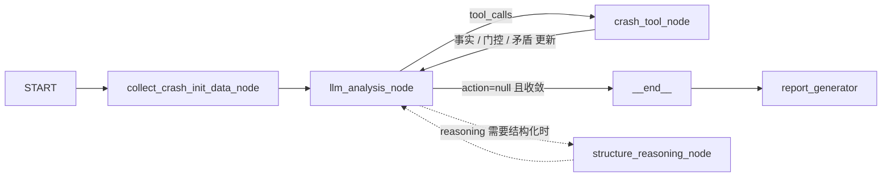
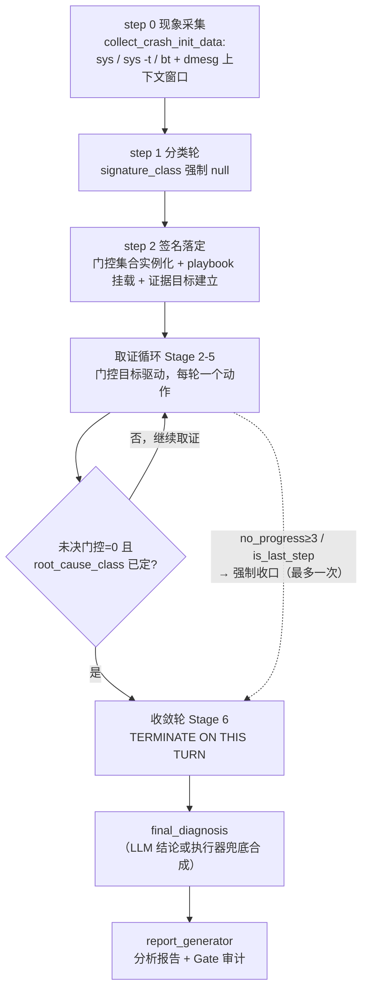
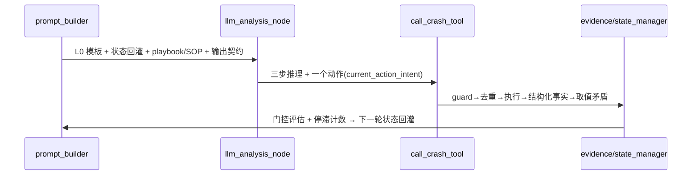

# VMCore Analysis Agent — 架构与核心逻辑

本文是给维护者的"读码地图"：先给一句话核心，再按数据流展开三个子系统，最后回答"想改 X 应该动哪个文件"。

## 一句话核心

**LangGraph 上的 ReAct 循环（LLM 决策 ↔ crash 工具执行），但 LLM 的输出从不直接生效——每一步都要经过执行器侧（executor-owned）的修复、审计、门控三层确定性治理。**

理解本项目的前提：结论字段（`root_cause_class`、`corruption_mechanism`、`is_conclusive`、`confidence`）有**两个写入者**——LLM 和执行器审计器。读代码时最先要分清"这句话/这个值是谁写的"。



- 图拓扑：`src/react/graph.py`（`create_agent_graph`）
- 路由：`src/react/edges.py`（`should_continue` / `after_crash_tool`）
- 步数上限：`main.py` 的 `AGENT_RECURSION_LIMIT = 121`
- 入口：`main.py` FastAPI `/analyze`、`/analyze/stream`（SSE），最终由 `report_generator.generate_markdown_report` 渲染报告

## 三个子系统（按数据流顺序）

### ① Prompt 组装 —— 发给 LLM 之前

唯一装配点：`prompt_builder.build_analysis_system_prompt(state, is_last_step=...)`。按状态动态拼接以下层：

| 层 | 文件 | 选择方式 |
|---|---|---|
| 总纲（Stage 0-6、S1-S5 anchor、禁止推理模式） | `layer0_system.py` | 恒定注入 |
| 崩溃类型剧本 | `playbooks.py`（`PLAYBOOKS`） | `_select_playbook` 按签名/近期文本选一个 |
| SOP 片段（DMA、stale-data 等专题） | `sop_fragments.py`（`SOP_FRAGMENTS`） | `_select_sop_fragments` 按信号动态追加 |
| 上下文 overlay | `prompt_overlays.py` | `_select_context_overlays` |
| 共享短语（如 `{S1_S5_DMA_GATE_RULE}`） | `prompt_phrases.py` | 占位符替换 |
| 执行器状态回灌 | `prompt_builder.build_executor_state_section` | 门控状态、未决矛盾、假设、下一步目标 |

**执行器状态回灌是 LLM 与执行器之间唯一的反馈通道**：门控没关、矛盾未解，都会以文本形式出现在下一轮 prompt 里。

`llm_runtime.py` 负责发送前的消息压缩（`compress_messages_for_llm`）与 `max_tokens` 自适应。

### ② LLM 输出强制管线 —— 每轮固定顺序（`llm_node.py`）

```
repair_structured_output            # JSON/枚举修复（output_parser）
→ apply_executor_consistency_audit  # 确定性审计：可改写结论字段、注入 audit note
→ apply_value_conflict_audit        # 未解决数值矛盾 → 压制收敛/改写根因
→ project_managed_analysis_step     # state_manager：合并 LLM gate 更新，
                                    #   evidence.evaluate_gate_closures 判定关闭，
                                    #   拒绝不满足准则的 LLM 关闭（llm_close_rejected）
→ build_tool_calls                  # action → tool_calls（含 action_guard 预检）
→ （收口轮：违规请求工具 → 强制重试一次）
→ apply_fallback_conclusion_synthesis # 收口轮兜底：确定性合成有界结论
```

`structure_reasoning_node`（`llm_node.structure_reasoning_content`）走同一条审计+投影链路（`_audit_and_project` 复用）。

### ③ 工具执行侧 —— `nodes.call_crash_tool`

```
validate_tool_call_request      # action_guard：命令合法性、参数校验、指纹去重
→ dispatch_crash_commands       # 经 MCP 执行（mcp_tools/registry.py 发现 provider）
→ extract_evidence_facts        # evidence：工具输出 → 结构化事实（见下方前缀表）
→ detect_value_conflicts        # consistency：struct 布局 vs 实际内存读数的矛盾
→ update_gate_evidence          # 门控证据累积
```

去重与防停滞状态在 `AgentState`：`executed_fingerprints`、`replayed_fingerprints`、`duplicate_streak`、`no_progress_streak`、`replan_required`。

重复命令的处理只有**一次**宽容：缓存输出有实质证据时，第一次重复回放 `[DEDUP]`（省预算），
并把指纹记入 `replayed_fingerprints`；同一指纹第二次被索取时不再回放，改发 `[DEDUP-BLOCKED]`
硬拒（走 `rejected` 分支，`no_progress_streak` 累加并触发 replan advisory）。否则"有证据"的
重复命令可以无限次骗取同一份输出，只能等 streak 触顶才被掐停。

硬拒消息本身只说"这条命令做过了"，不给出口；当 `no_progress_streak` 达
`CONVERGENCE_GUARD_STREAK_THRESHOLD` 且被拒命令全部是只读取值探测（`rd`/`struct`/`dis`/`kmem`
等，见 `_READONLY_VALUE_PROBE_COMMANDS`）时，`[DEDUP-BLOCKED]` 追加 `FORCED_CHOICE_CONVERGENCE_RULE`
强制二选一：(A) 立即提交结论（`root_cause_class` 必须是真实类，不能是 `unknown`），或
(B) 声明一个此前未观测过的新证据目标。该通道**刻意不看根因是否已提交、也不看门控是否关闭**，
因为真实耗尽预算的 run 恰恰是模型从未提交根因、且在 dedup 分支提前 `continue` 而走不到
`_convergence_guard_error`；`prompt_builder._build_replan_probe_menu` 用同一份措辞镜像到转向菜单。

"根因是否已提交"统一由 `graph_state.has_committed_root_cause` 判定：`None`、`""`、`unknown`
都算未提交（`unknown` 是 `RootCauseClass` 的合法成员且为真值，直接真值判断会把"尚未定论"
当成"结论已成立"，让 `TERMINATE ON THIS TURN` 等通道在错误前提上运行）。

## 一次分析的完整生命周期：从现象到根因

前面三个子系统是"静态结构"；这一节按**时间轴**讲一次 `/analyze` 请求里 agent 如何一步步从
现象推到根因。主干不是固定 pipeline，而是"**执行器定骨架、LLM 选动作**"的 ReAct 循环。
每一步"现在在哪、还缺什么、允许做什么"由三个确定性机制算出并回灌进 prompt，LLM 只决定
"这一轮执行哪条 crash 命令、当前假设是什么"：

1. **Stage 0-6 方法论**（`layer0_system.py` PART 0 / 2.2）——固定主干阶段：分类 → 定位故障
   指令 → 寄存器溯源 → 故障地址分类 → 对象验证 → 破坏源区分 → 根因假设；
2. **签名类强制门控**（`schema._REQUIRED_GATES` → `managed_gates`）——还缺哪些证据、什么才
   允许下结论；
3. **步数预算**（`prompt_builder._infer_stage_name` + SOP 触发条件 + layer0 2.4a 里程碑）——
   现在处于哪个阶段、到当前步数必须达成什么。

> `step_count` 按**节点**累加（llm 节点与 crash_tool 节点各 +1，一次往返 +2），下文步数均指
> 该计数器，与人类直觉的"第几轮工具调用"不同。



### 阶段 0：现象采集（step 0，不进 ReAct 循环）

`nodes.collect_crash_init_data`：

- 并发执行 `DEFAULT_CRASH_COMMANDS`：`sys`（系统概况）、`sys -t`（崩溃时间戳）、`bt`（崩溃栈）；
- 从 bt 提取 panic 的 PID/CPU/COMMAND，据此在 vmcore-dmesg 中定位匹配行，取其**前 50 行**作为
  崩溃前上下文窗口；
- 拼成第一条 HumanMessage（`initial_crash_data`）——这就是 LLM 拿到的"现象"全集；
- 初始化失败 → 置 `error` → `should_continue` 直接路由 `__end__`。

### 阶段 1：签名分类（Stage 0-1，step 1-2）

signature_class 决定后续所有分支（playbook、SOP、门控集合），因此被拆成两步并有执行器纠偏：

| 时点 | 约束 | 机制 |
|---|---|---|
| step 1 | `signature_class` 必须为 null，只许基于 panic 串/bt/dmesg 分类 | layer0 2.1，schema 校验拒绝 |
| step 2 | 必须给出具体 signature_class | layer0 2.1 |
| 落定轮 | CR2 实际访问类型与签名类不符 → 执行器直接改写 | `output_parser._normalize_signature_class_from_fault_context`；`_detect_page_fault_access_mismatch` 注入矛盾说明 |

签名类落定的同一轮，`state_manager` 完成三件事，等于给后续循环"铺轨"：

- `_build_managed_gates`：按 `schema._REQUIRED_GATES[signature_class]` 实例化强制门控（如
  pointer_corruption → register_provenance + object_lifetime + local_corruption_exclusion；
  external_corruption_gate 初始 blocked，前置为 local_corruption_exclusion）；
- `_build_evidence_goal`：把第一个 open/blocked 门控映射成"当前证据目标"（需要哪些 evidence
  type；goal_version 递增用于解锁去重缓存）；
- `prompt_builder._select_playbook`：挂载该签名类的取证剧本。

### 阶段 2：取证循环（Stage 2-5）——每轮 6 个环节



1. **Prompt 装配**（`build_analysis_system_prompt`，逐层见"① Prompt 组装"）。关键是执行器状态
   回灌 `build_executor_state_section`：步数/阶段名、签名类与根因类、活跃假设、门控状态、当前
   门控目标、证据目标+版本、取值矛盾、上次动作状态（executed/duplicate/rejected/no_progress +
   streak）、replan 菜单、已执行命令清单。LLM 的"工作记忆"是这一段，而不是完整消息历史
   （历史会被 `compress_messages_for_llm` 压缩）。
2. **LLM 推理契约**：reasoning 必须三段（读最新 ToolMessage → 更新假设 → 为什么这个动作能推进
   当前门控）；action 必须携带 `current_action_intent`（intended_evidence_type / target_field /
   expected_disambiguation），否则被 executor-guard 拒绝——拒绝不是失败，而是以 ToolMessage
   形式反馈给 LLM 驱动 replan。
3. **审计与投影**（`llm_node._audit_and_project`）：consistency audit → value conflict audit →
   `project_managed_analysis_step`。执行器在此改写 LLM 输出：有未决门控却声明
   `is_conclusive=true` → 强制降级并清空 final_diagnosis；假设与门控是受管字段，LLM 的声明只是
   输入。
4. **工具执行**（`call_crash_tool`，逐环节见"③ 工具执行侧"）：guard → 指纹去重 → 执行 → 每份
   输出抽取结构化事实（`evidence_facts` / `struct_layout_cache` / 内存读数 /
   `crash_path_struct_offsets`）→ 取值级矛盾检测（`value_conflicts`，独立于证据事实）。
5. **门控评估**（`evidence.evaluate_gate_closures`）：只有满足 `_GATE_COMPLETION_CRITERIA` 的阳性
   证据组合才关闭门控（如 register_provenance 需要 rd + dis/sym 且地址关联）；LLM 申请关闭但
   证据不足 → 回退并记录 `llm_close_rejected`；全部变迁写入 `gate_transition_history` 供审计。
6. **停滞计数与路由**：`duplicate_streak` / `no_progress_streak` / `replan_required` 更新；结论已
   成立却还在只读探测 → `_convergence_guard_error` 拒绝空转；`edges.py` 决定回 llm 节点还是走向
   收口。DeepSeek-Reasoner 只输出 reasoning 无 content 时，路由到 `structure_reasoning_node` 用
   chat 模型补结构化，再回到主循环。

### 阶段 3：分支覆盖是如何实现的

"覆盖所有分析路径"不是并行探索，而是四层条件挂载 + 一份负面清单：

| 层 | 选择机制 | 触发条件 |
|---|---|---|
| Playbook | `_select_playbook(signature_class)` | 每个签名类一个剧本；stack_protector 命中 panic 串时特判 |
| SOP 片段 | `_select_sop_fragments` | DMA（step≥10 且门控/关键词命中）、per_cpu、address_search、driver_source_correlation（step≥6）、stack_overflow、stack_protector_fast_path、stack_frame_forensics、kasan_ubsan、advanced_techniques（step≥18） |
| Context overlays | `_select_context_overlays` | 栈破坏 / 驱动对象关键词命中时叠加 |
| mpykdump 扩展工具 | layer0 PART 3 | 场景触发（hung_task→hanginfo、块层挂死→rqlist、SCSI→scsishow 等），并标注"优先于手工等价命令" |

- **卡住时的转向菜单**：`_build_replan_probe_menu` 用确定性状态列出未探索的证据维度
  （rd/struct/dis/sym）与未读过的目标对象，要求换假设或换目标，而不是重复"曾经成功"的命令；当
  根因类已定且门控全关时，菜单整体替换为 `TERMINATE ON THIS TURN`（防止收尾轮继续探测）。
- **负面分支覆盖**：layer0 PART 0 的禁止命令/禁止推理模式清单，显式封死错误路径（对象验证前命名
  驱动、无阳性证据跳 DMA/硬件、用 `kmem -S [ALLOCATED]` 排除 UAF 等）。
- **机制区分要求**：Stage 5 / S4 规定 UAF、栈溢出、本地覆盖**各自需要阳性证据**才能被区分或确认
  ——`[ALLOCATED]` 只是快照状态，"没找到证据"不等于"排除"。

### 阶段 4：收敛与根因输出（Stage 6）

收敛准则（layer0 2.4）：`is_conclusive=true` 需要 ≥2 个独立证据源 + 完整因果链 + 显式写出最强
替代假设 + 无强制验证缺口。判定经历三重把关：

1. LLM 自评（prompt 中的准则文本）；
2. 执行器降级（`project_managed_analysis_step`：有未决门控即强制 `is_conclusive=false`）；
3. 一致性审计（可改写 root_cause_class、压制收敛，直到取值矛盾被 LLM 显式核对剔除）。

终止路径（全部通向 `__end__`）：

| 路径 | 触发 | 行为 |
|---|---|---|
| 正常结论 | is_conclusive + final_diagnosis 且门控全关 | `should_continue` 路由 end |
| 步数耗尽 | LangGraph 运行时在接近 `recursion_limit`（`AGENT_RECURSION_LIMIT=121`）时把内置 `is_last_step` 置 True | prompt 注入 CRITICAL WARNING，`build_tool_calls` 剥掉 tool_calls |
| 空转收口 | `no_progress_streak≥3` | `after_crash_tool` 触发一次强制收口（`force_terminal_wrapup` 保证只发生一次） |
| 空转强制二选一 | `no_progress_streak≥CONVERGENCE_GUARD_STREAK_THRESHOLD` 且重复命令均为只读取值探测 | dedup 硬拒与 replan 菜单追加 `FORCED_CHOICE_CONVERGENCE_RULE`（提交结论 / 声明新证据目标），在触顶收口前把模型推向可执行出口 |
| 收口轮违规 | 收口轮仍请求工具 | 追加 terminal-only 硬性指令，重试且仅重试一次 |
| 兜底合成 | 收口轮无结论，但根因类已定 + 强制门控全关 | `apply_fallback_conclusion_synthesis` 把已闭合证据确定性地渲染成 confidence=low 的有界结论 |

输出：`final_diagnosis` → `generate_markdown_report`（逐步过程回放、验证摘要，其中包含
"ALLOCATED 只是快照状态"的解读提醒）+ `generate_gate_audit_report`（门控变迁独立审计）。

### 步数轴速查

`step_count` 是节点级计数器；`_infer_stage_name` 据此（叠加首个未决门控）给出当前阶段名，
layer0 2.4a 则给出各里程碑必须达成的目标：

| step_count | 阶段（`_infer_stage_name`） | 系统侧关键行为 / 里程碑 |
|---|---|---|
| 0 | — | 初始化采集（sys/sys -t/bt + dmesg 窗口） |
| 1 | Stage 0-1 | signature_class 强制 null |
| 2-3 | Stage 0-1 | 签名落定、门控实例化、playbook 挂载、证据目标建立 |
| 4-9 | Stage 2-5 | step≥5：RIP 指令、CR2 分类、坏操作数来源必须已识别；step≥6 起驱动源码关联 SOP |
| 10-17 | Stage 4-5 | step≥10：至少一个具体对象/page/来源已在检视；DMA SOP 按条件注入 |
| ≥18 | Stage 6 | step≥20：至少一类阳性证据（生命周期/page 归属/设备侧）；step≥24 仍无设备侧证据则禁止点名设备/驱动；advanced SOP，prompt 要求每轮只发一条决定性命令 |
| 接近 121 | — | LangGraph 置 `is_last_step`，进入强制收口；到 121 硬停 |

## 门控（gates）—— 收敛的硬门槛

定义：`schema.GateEntry`（status: `open|closed|blocked|n/a`，`required_for` 按 `signature_class` 决定哪些门控必须关闭才允许 `is_conclusive=true`）。

执行器管理的门控集合（`evidence._GATE_COMPLETION_CRITERIA`）：

| gate | 关闭准则（executor-owned，LLM 不能口头关闭） |
|---|---|
| `register_provenance` | 寄存器写入来源被独立观察（dis/rd/sym 等） |
| `object_lifetime` | 同槽位 `kmem -S` 状态 + 基址内存均被观察，或有直接生命周期证据（KASAN）；ALLOCATED 快照不排除 UAF-with-reuse |
| `local_corruption_exclusion` | 有相关反汇编 + 内存观察支持或排除本地写入者 |
| `field_type_classification` | struct 布局证据 + 类型/符号佐证 |
| `external_corruption_gate` | 前置 `local_corruption_exclusion` 已关闭 + 至少一条具体外部来源观察 |

依赖关系：`external_corruption_gate` 被 `local_corruption_exclusion` 阻塞（`state_manager` 维护）。LLM 只能"申请"关闭，`evaluate_gate_closures` 按事实判定，不满足则记录 `llm_close_rejected` 事件并写进报告。

证据事实前缀（`evidence.extract_evidence_facts`）：`rd_word:`、`struct_`、`dis_`、`sym:`、`vtop_`、`kmem_`、`kmem_slab_state:0x<addr>=allocated|free`、`kmem_vmap_range:`、`lifetime_proof:`（KASAN UAF 专用）。

## 工具层（`src/mcp_tools/`）

- `registry.py`：按目录名约定发现 provider（`crash`、`source_patch`、`stack_canary`），统一注入 `vmcore_path`/`vmlinux_path`
- `crash/`：crash 命令执行（server/client/executor）；`stack_canary/`、`source_patch/` 为专题工具

## 报告（`report_generator.py`）

- `generate_markdown_report`：面向读者的最终报告（含验证状态摘要、`ALLOCATED` 语义说明）
- `generate_gate_audit_report`：门控关闭/拒绝审计
- gate 中英标签映射在文件头部字典

## "想改 X 动哪里" 速查

| 目标 | 位置 |
|---|---|
| 改分析方法论/措辞（如 UAF 判定口径） | `layer0_system.py`（总纲）、`playbooks.py`（剧本）、`sop_fragments.py`（专题）、`prompt_phrases.py`（共享短语） |
| 改门控关闭条件 | `evidence.py`（`_GATE_COMPLETION_CRITERIA` + `_gate_criteria_satisfied`） |
| 改"LLM 结论如何被强制改写" | `output_parser.py` 对应 `_audit_*` |
| 改命令合法性/去重 | `action_guard.py` |
| 改收敛/路由（何时结束、何时重试） | `edges.py`、`llm_node.py`（收口逻辑）、`nodes._convergence_guard_error` |
| 改报告呈现 | `report_generator.py` |
| 加新崩溃类型剧本 | `playbooks.py` 加条目 + `prompt_builder._select_playbook` 选择信号 |

注意：prompt 文本改动要检查 `tests/test_prompt_builder.py`、`test_convergence.py` 是否断言了相关字符串；门控改动跑 `tests/test_evidence.py`。

## 验证

```powershell
# 必须用项目 venv（系统 Python 缺依赖）
.\.venv\Scripts\python.exe -m pytest tests -q
```

## 已知语义风险（备忘）

- `object_lifetime` 的 KASAN 事实（`lifetime_proof:`）未与目标槽位地址绑定，任意 KASAN UAF 事实即可关闭该门控（`evidence._gate_criteria_satisfied`）。
- `local_corruption_exclusion` 是代码级门控名，措辞上仍是 exclusion；prompt 侧已统一为 discrimination 语义，重命名标识符需同步 `state_manager`/`schema`/`report_generator` 与测试。
