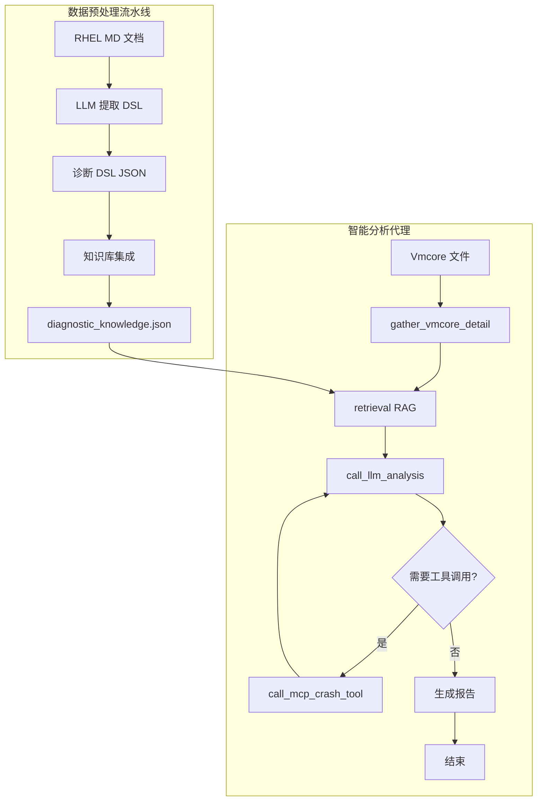
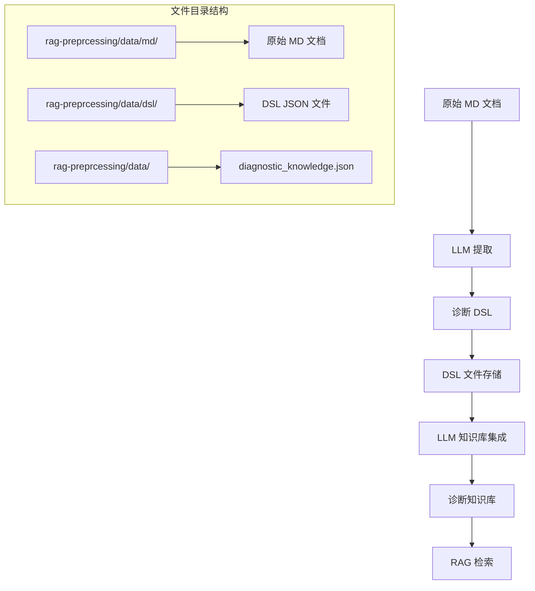
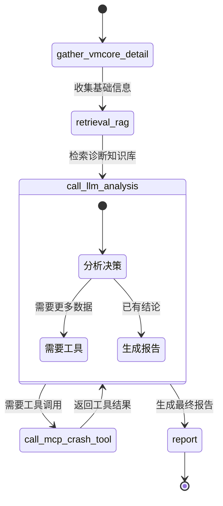

# VMCore Analysis Agent

一个基于 LangGraph 和 MCP 的智能 vmcore 分析代理，能够自动诊断 Linux 内核崩溃问题。

## 项目概述

VMCore Analysis Agent 是一个结合了 RAG（检索增强生成）和 ReAct（推理与行动）框架的智能诊断系统。它能够：

1. **从 RHEL 官方文档中提取诊断逻辑**：将非结构化的故障排除文档转化为结构化的诊断知识库，将 rhel engineer 的经验进行沉淀
2. **自动化 vmcore 分析**：通过智能代理自动执行 crash 工具命令，分析内核转储文件
3. **提供诊断建议**：基于历史案例和诊断知识库，给出问题根因分析和解决方案

## 架构设计

### 整体架构图



## 第一部分：RAG 数据预处理流水线

### 1.1 数据来源

项目从 RHEL（Red Hat Enterprise Linux）官方知识库中收集了大量内核故障排除文档，这些文档以 Markdown 格式存储，包含：

- **故障现象描述**：具体的错误信息和堆栈跟踪
- **诊断步骤**：专家手动执行的 crash 工具命令序列
- **根因分析**：问题根本原因和修复方案

### 1.2 处理流程

#### 步骤 1：从 MD 文件中提取 DSL（诊断逻辑）

使用 LLM（DeepSeek）从原始 Markdown 文档中提取结构化的诊断逻辑：

```python
# 提取流程
MD 文档 → LLM 解析 → 诊断 DSL（JSON 格式）

# DSL 结构示例
{
  "os": "Red Hat Enterprise Linux 7",
  "scenario": "Soft lockup or Hard lockup due to race between ring_buffer_detach() and ring_buffer_wakeup()",
  "symptoms": ["NMI watchdog: BUG: soft lockup - CPU#0 stuck for 22s!"],
  "workflow": [
    {
      "step_number": 1,
      "thought": "Check system information and panic details",
      "action": "sys -i",
      "observation": "System BIOS, vendor, and product details"
    }
  ]
}
```

#### 步骤 2：从 DSL 中汇总诊断字典

将多个 DSL 文件整合为统一的诊断知识库：

```python
# 集成流程
多个 DSL JSON → LLM 整合 → diagnostic_knowledge.json

# 诊断知识库结构
{
  "summary": "Comprehensive diagnostic matrix for Linux kernel Hard LOCKUP scenarios",
  "init_cmds": ["sys -i", "bt", "log | grep -i lockup"],
  "matrix": [
    {
      "trigger": "Watchdog detected hard LOCKUP on cpu {cpu}",
      "action": "bt -c {cpu}",
      "arg_hints": "cpu: CPU number from lockup message",
      "why": "Examine what's running on the locked CPU",
      "expect": "Stack trace showing stuck function or spinlock",
      "is_end": false
    }
  ]
}
```

#### 步骤 3：数据对比示例

##### 示例 1：系统信息检查 (sys -i)

以 `3870151.md` 和 `3870151.json` 为例：

**原始 MD 文件中的诊断步骤**：
```markdown
## Diagnostic Steps
- vmcore analysis
crash> sys -i
crash> bt

crash> sys -i
        DMI_BIOS_VENDOR: innotek GmbH
       DMI_BIOS_VERSION: VirtualBox
          DMI_BIOS_DATE: 12/01/2006
         DMI_SYS_VENDOR: innotek GmbH
       DMI_PRODUCT_NAME: VirtualBox
```

**提取的 DSL 片段**：
```json
{
  "step_number": 1,
  "thought": "Check system information and panic details",
  "action": "sys -i",
  "observation": "System BIOS, vendor, and product details"
}
```

**最终诊断知识库条目**：
```json
{
  "trigger": "Need to check system information",
  "action": "sys -i",
  "arg_hints": null,
  "why": "Get kernel version, BIOS, and system configuration",
  "expect": "Kernel version, BIOS version, system uptime",
  "is_end": false
}
```

##### 示例 2：堆栈回溯分析 (bt -c {cpu})

以 `6348992.json` 为例：

**原始 MD 文件中的相关症状**：
```markdown
## Issue
- Hard lockup occurs with following messages:
[26404900.348486] NMI watchdog: Watchdog detected hard LOCKUP on cpu 23
```

**提取的 DSL 片段**：
```json
{
  "step_number": 10,
  "thought": "Examine backtrace of CPU 72 to understand its state",
  "action": "bt -c 72",
  "observation": "CPU 72 in idle state with mwait_idle_with_hints"
}
```

**最终诊断知识库条目**：
```json
{
  "trigger": "Watchdog detected hard LOCKUP on cpu {cpu}",
  "action": "bt -c {cpu}",
  "arg_hints": "cpu: CPU number from lockup message",
  "why": "Examine what's running on the locked CPU",
  "expect": "Stack trace showing stuck function or spinlock",
  "is_end": false
}
```

##### 示例 3：结构体检查 (struct spinlock_t)

以 `6348992.json` 为例：

**原始 MD 文件中的诊断上下文**：
```markdown
## Diagnostic Steps
- vmcore analysis
crash> bt
    [exception RIP: _raw_spin_lock_irqsave+0x26]
    RIP: ffffffffa496c816  RSP: ffff90da3fd03d88  RFLAGS: 00000046
    RAX: 0000000000000000  RBX: 0000000000000046  RCX: 0000000000000000
    RDX: 0000000000000001  RSI: 0000000000000003  RDI: ffff90da3a6cd2a8
```

**提取的 DSL 片段**：
```json
{
  "step_number": 11,
  "thought": "Inspect spinlock state that's causing the deadlock",
  "action": "struct spinlock_t ffff8820b8915a80",
  "observation": "Spinlock raw_lock value showing waiter/serving tickets"
}
```

**最终诊断知识库条目**：
```json
{
  "trigger": "Spinlock deadlock suspected at address {addr}",
  "action": "struct spinlock_t {addr}",
  "arg_hints": "addr: spinlock address from backtrace or memory dump",
  "why": "Check spinlock state for deadlock indicators",
  "expect": "raw_lock showing waiter/serving ticket mismatch",
  "is_end": false
}
```

**完整转换流程总结**：
1. **MD 文档分析**：从原始 RHEL 知识库文章中提取故障现象和诊断步骤
2. **DSL 提取**：使用 LLM 将非结构化的诊断步骤转化为结构化的 DSL（诊断逻辑）
3. **知识库集成**：将多个 DSL 文件整合为统一的诊断知识库，进行泛化和去重
4. **参数抽象**：将具体值（CPU 编号、内存地址）替换为占位符（{cpu}、{addr}）
5. **意图保留**：保持原始诊断思想的核心目的和逻辑
6. **上下文增强**：添加参数提示和期望结果，形成完整的诊断规则

### 1.3 处理流程图



### 1.4 关键代码文件

- `rag-preprcessing/extract_md-dsl/extract_integrate.py`：从 MD 提取 DSL 的主程序
- `rag-preprcessing/dsl-diagnostic_dict/dsl_integration.py`：集成 DSL 到诊断知识库
- `rag-preprcessing/data/diagnostic_knowledge.json`：生成的诊断知识库

## 第二部分：Vmcore Analysis React Agent

### 2.1 代理架构

基于 LangGraph 的 ReAct（推理 - 行动）代理，包含五个核心节点：

1. **gather_vmcore_detail_node**：收集 vmcore 基础信息
2. **retrieval_rag_node**：从 RAG 检索诊断知识库
3. **llm_analysis_node**：LLM 分析决策
4. **crash_tool_node**：执行 MCP crash 工具
5. **报告生成**：输出最终诊断结果

### 2.2 节点流转图



### 2.3 详细节点说明

#### 节点 1：gather_vmcore_detail_node
**功能**：执行默认的 crash 命令集合，收集 vmcore 基础信息
**默认命令**：
```python
DEFAULT_CRASH_COMMANDS = [
    "sys",    # 系统信息
    "bt",     # 所有线程的堆栈回溯
    "runq",   # 运行队列
    "swap",   # 交换空间
    "timer",  # 定时器信息
    "sig",    # 信号处理
    "mach",   # 机器相关信息
    "ipcs",   # IPC 信息
    "waitq",  # 等待队列
]
```

#### 节点 2：retrieval_rag_node
**功能**：从 RAG 检索诊断知识库，基于收集的 vmcore 信息查找相关诊断逻辑
**检索流程**：
1. 提取 vmcore 中的关键症状（错误信息、堆栈符号等）
2. 在 `diagnostic_knowledge.json` 中检索匹配的诊断规则
3. 返回相关的诊断矩阵和初始命令建议
**技术实现**：
- 向量数据库：存储诊断知识库的嵌入向量
- 相似度检索：基于症状匹配最相关的诊断规则
- 上下文增强：将检索结果作为 LLM 分析的上下文

#### 节点 3：llm_analysis_node
**功能**：基于收集的信息和 RAG 检索结果，决定下一步行动
**决策逻辑**：
- 如果已有足够信息 → 生成诊断报告
- 如果需要更多数据 → 调用 crash 工具
- 如果遇到错误 → 终止流程

#### 节点 4：crash_tool_node
**功能**：通过 MCP（Model Context Protocol）调用 crash 工具
**技术栈**：
- MCP 服务器：提供 crash 工具接口
- LangChain MCP Adapters：工具调用适配层
- 异步执行：并发执行多个工具调用

#### 节点 5：报告生成
**功能**：汇总所有分析结果，生成结构化诊断报告

### 2.4 状态流转逻辑

```python
def should_continue(state: AgentState) -> str:
    """决定下一步执行的节点"""
    # 1. 检查错误状态
    if state.get("error"):
        return "__end__"

    # 2. 检查最后一条消息
    last_message = state["messages"][-1]

    # 3. 如果是 HumanMessage（来自 gather_vmcore_detail）
    if isinstance(last_message, HumanMessage):
        return "retrieval_rag_node"  # 进入 RAG 检索

    # 4. 如果是 ToolMessage（来自 crash_tool_node）
    elif isinstance(last_message, ToolMessage):
        return "llm_analysis_node"  # 返回 LLM 分析

    # 5. 如果是 AIMessage 且有工具调用
    elif isinstance(last_message, AIMessage) and last_message.tool_calls:
        return "crash_tool_node"  # 执行工具

    # 6. 如果是 AIMessage 但无工具调用
    elif isinstance(last_message, AIMessage):
        return "__end__"  # 生成报告

    # 7. 其他情况继续分析
    return "llm_analysis_node"
```

### 2.5 图构建代码

```python
def create_agent_graph(llm, tools_list):
    """构建 LangGraph 状态图"""
    builder = StateGraph(AgentState)

    # 添加节点
    builder.add_node("gather_vmcore_detail_node", gather_vmcore_detail)
    builder.add_node("retrieval_rag_node", retrieval_rag)
    builder.add_node("llm_analysis_node", partial(call_llm_analysis, llm_with_tools=llm))
    builder.add_node("crash_tool_node", call_crash_tool)

    # 添加边
    builder.add_edge(START, "gather_vmcore_detail_node")
    builder.add_conditional_edges("gather_vmcore_detail_node", should_continue)
    builder.add_conditional_edges("retrieval_rag_node", should_continue)
    builder.add_conditional_edges("llm_analysis_node", should_continue)

    return builder.compile()
```

### 2.6 MCP Crash 工具集成

项目通过 MCP 协议与 crash 工具集成：

```python
# MCP 工具调用示例
async def _invoke_tool(tool, cmd: str, state: AgentState) -> str:
    """调用 crash MCP 工具执行命令"""
    result = await tool.ainvoke({
        "command": cmd,
        "vmcore_path": state["vmcore_path"],
        "vmlinux_path": state["vmlinux_path"]
    })
    return result
```

## 项目结构

```
vmcore-analysis-agent/
├── README.md                          # 项目说明文档
├── main.py                            # 主程序入口
├── pyproject.toml                     # Python 项目配置
├── config/
│   └── config.yml                     # 配置文件
├── rag-preprcessing/                  # RAG 数据预处理
│   ├── data/
│   │   ├── md/                        # 原始 MD 文档
│   │   ├── dsl/                       # 提取的 DSL 文件
│   │   └── diagnostic_knowledge.json  # 诊断知识库
│   ├── extract_md-dsl/                # MD 到 DSL 提取
│   └── dsl-diagnostic_dict/           # DSL 到知识库集成
├── src/
│   ├── llm/                           # LLM 模型配置
│   ├── react/                         # ReAct 代理实现
│   │   ├── graph.py                   # 图构建
│   │   ├── nodes.py                   # 节点实现
│   │   ├── edges.py                   # 边逻辑
│   │   ├── graph_state.py             # 状态定义
│   │   └── prompts.py                 # 提示词模板
│   ├── mcp_tools/crash/               # MCP crash 工具
│   ├── retrival/                      # RAG 检索模块
│   └── utils/                         # 工具函数
└── logs/                              # 日志目录
```

## 快速开始

### 1. 安装依赖

```bash
cd vmcore-analysis-agent
pip install -e .
```

### 2. 配置环境变量

```bash
export DEEPSEEK_API_KEY="your-api-key"
export MCP_CRASH_SERVER_PATH="/path/to/crash/server"
```

### 3. 运行数据预处理

```bash
# 提取 MD 到 DSL
python rag-preprcessing/extract_md-dsl/extract_integrate.py

# 集成 DSL 到知识库
python rag-preprcessing/dsl-diagnostic_dict/dsl_integration.py
```

### 4. 运行分析代理

```bash
python main.py
```

## 技术栈

- **LangGraph**: 代理状态图管理
- **LangChain**: LLM 应用框架
- **MCP (Model Context Protocol)**: 工具调用协议
- **DeepSeek API**: LLM 服务
- **Pydantic**: 数据验证和序列化
- **异步编程**: asyncio 并发执行

## 应用场景

1. **自动化故障诊断**：自动分析 vmcore 文件，减少人工干预
2. **知识库构建**：从历史案例中提取可复用的诊断逻辑
3. **新手培训**：作为学习内核调试的教学工具
4. **生产环境监控**：集成到运维平台，实现自动告警分析

## 未来扩展

1. **更多诊断场景**：支持除 lockup 外的其他内核问题
2. **多模态分析**：结合日志、指标等多维度数据
3. **实时分析**：支持在线系统的实时诊断
4. **分布式部署**：支持大规模并发分析

## 贡献指南

欢迎提交 Issue 和 Pull Request 来改进项目。

## 许可证

MIT License
